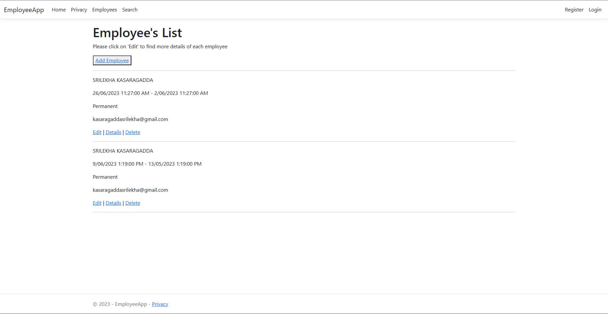

# EmployeeCreator

# employee-creator



# Overview
To create web application which can create list, modify and delete employees.

# MVP

* This project is employee creator in ASP.NET with C#.
* This project has 3 endpoints:
  1. Create an employee.
  2. Get a list of existing employees.
  3. To delete an employee.
  4. Edit an EMployee.
  5. Search foran Employee.
* The list of employees is a local MySql database.

# Build Steps
```
cd EmployeeCreator
```
# Design Goals

The Design is simple which shows the employee details and enables users to perform CRUD Operations.

# Tech Stack
* ASP.NET with C#.

# Features
* A navbar with all Employees and to search Employees.
* The Employees Page shows all the employees present in the Database. This Page also contains a button to Add Employee, Edit and Delete an Employee.
* By Clicking on "Add Employee" button, a form is displayed to enter the employee details.
* By Cliking the edit button, a form with employee details is displayed. The user can edit the details and submit.
* By clicking on the Delete button, the employee is deleted and automatically removed from the page.

